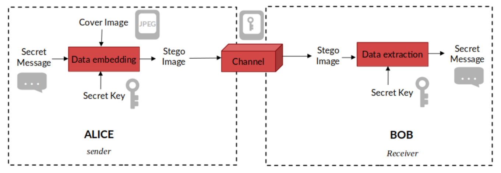
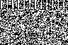
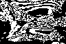

**Project Type:** 

**Programming:** 

As part of a Master I cryptography project, I implemented a software program that performs steganography and steganalysis. The software allows hiding grayscale images and text messages in a so-called grayscale **stego image**. Various methods can be used:
1. Hiding the information in the Least Significant Bits (LSB) plane of the image (default behavior).
2. Hiding secret data in a chosen bit plane among the 8 possible ones.
3. Choosing the pixels randomly, with a seed as a key to recover the secret data.
4. Encoding sequentially the secret over the pixels of the stego image (default behavior).

The software can also decrypt the message/image hidden in a stego image by knowing the length of the secret.

### Steganalysis

In this project, it is possible to perform steganalysis by extracting the bit planes of a grayscale image to visually examine if secret data is embedded. It also allows comparing two different image planes by displaying their difference. Thus, it's possible to see clearly where the secret is embedded, as we know the before and after stego images.

<html lang="en">
<head>
    <meta charset="UTF-8">
    <meta name="viewport" content="width=device-width, initial-scale=1.0">
    <title>Bit plan extraction of a stego image</title>
    
</head>
<body>
    

        <figure class="image-item">
            
            <figcaption>LSB plan</figcaption>
        </figure>
        <figure class="image-item">
            
            <figcaption>Intermediate plan</figcaption>
        </figure>
        <figure class="image-item">
            
            <figcaption>MSB plan</figcaption>
        </figure>
        <figure class="image-item">
            
            <figcaption>Stego image 96x64 pixelsn</figcaption>
        </figure>
    

</body>
</html>

<!--more-->
